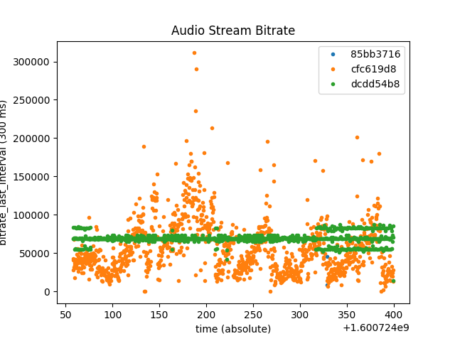

# rtpcap: A Tool for RTP Trace Analysis

By [Chema Gonzalez](https://github.com/chemag), 2020-08-24


# Introduction
rtpcap is a tool for parsing tcpdump (pcap) traces containing RTC (real-time communications) media contents encapsulated using RTP. Goal is to script most of the tasks needed to get an understanding of video, audio, network, and even performance issues for video-conference (VC) clients based on their network traffic.

Main insight behind rtpcap is that network traffic is the main interface between clients in a VC. In particular, almost all VC systems use RTP, so by understanding the RTP contents, we can get some understanding of what happened during the call. Note that almost all VC systems encrypt the RTP payloads, but there is still enough data in the RTP headers to get a good understanding of the media dynamics.

rtpcap is basically a [tshark](https://www.wireshark.org/docs/man-pages/tshark.html) (terminal-based wireshark) wrapper plus some python code to select and/or aggregate some of the packet statistics in a stream. A stream is defined in the RTP sense, i.e., as all the packets that have the same IP src address and RTP SSRC field.

In particular, rtpcap produces 3 types of aggregation:

* packet: information is obtained for each packet (i.e. no aggregation at all)
* frame: information is aggregated for each video frame
* time: information is aggregated in a temporal basis

We also provide 3 different types of analysis, depending on the assumption of what the stream contains:

* network: no assumptions at all
* video: assumes the stream contains video (and therefore ...
* audio: assumes the stream contains audio

Combining the aggregation levels and the media type, we have so far defined the following analysis types:

* (1) network-time: time aggregation of network statistics
* (2) audio-packet: audio-only per-packet information
* (3) video-time: time aggregation of video-only information
* (4) video-frame: frame aggregation of video-only information
* (5) video-packet: video-only per-packet information


## network-time Analysis Mode

network-time performs basic aggregation of network statistics, including packets, bytes, and a bitrate estimation. It dumps a list of all the RTP sequence numbers and RTP timestamps it sees in the aggregation period. It also does an estimation of lost, out-of-order, and duplicate packets based on the RTP Sequence numbers.

It allows setting the aggregation period (`--period-sec` option).


## audio-packet Analysis Mode

audio-packet performs per-packet aggregation of audio statistics, including time between consecutive packets (`delta_time`), distance between consecutive RTP sequence numbers, whether the packet is a duplicate (by checking the RTP payload type, sequence number, and timestamp), and the RTP generic extension header contents (per rfc5285), which is used sometimes to dump audio levels (per rfc6464).


## video-time Analysis Mode

video-type performs basic aggregation of video statistics, including framerates.


## video-frame Analysis Mode

video-frame performs frame aggregation of video statistics, including packet and byte sizes, frame types (I-frames vs. P-frames, estimating using a heuristic), and RTP timestamps and their latency.

It also measures per-frame latency and inter-frame latency, defined as:

* (1) intra-frame latency: time between the first packet of each frame, and the last packet of the same frame *that arrives before the first packet of the next frame*.

For example, let's assume that packets from frame `A` arrive at times `A1..Am`, and packets from frame `B` arrive at times `B1..Bn`. Intra-frame latency is the "time between the first and last packets of a frame", or `Am - A1` for frame A. Instead, we measure `Aj - A1`, where `Aj` is the last frame of A before the first frame from B. For example, if `A1 < A2 < ... < Aj < Bk < Aj+1 < Am`, then video-frame measures `Aj - A1`. This slightly-modified definition makes the implementation much easier, and should not make much of a difference, as packets are always sent in order (i.e.  `An < B1` at the sender).

* (2) inter-frame latency, measured as the time between the first packets of 2 consecutive frames.


## video-packet Analysis Mode

video-packet performs per-packet aggregation of video statistics, RTP timestamps and markers, the frame video type (see above), and the frame latency, measured as the time between the first packets of 2 consecutive frames.


# Discussion

Discussion:

* pro: does not need instrumenting the VC system
* pro: supports any VC system that uses RTP (almost all, though some add proprietary headers between UDP and RTP)
* pro: modular architecture (allows easy extensions)
* implemented as a python script on top of tshark
* unix principle: only extract timeseries data from the packet trace, and put into an easily-accessible format (csv),
* works together with [plotty](https://github.com/chemag/plotty)

Open questions:
* how to put rtpcap and plotty together more easily?


# Examples

Get the network information of a packet trace:

```
$ ~/proj/rtpcap/rtpcap.py --period-sec 0.3 --network-time black.pcap
options: Namespace(analysis_type='network-time', connections=1, debug=0, dry_run=False, filter=None, infile='black.pcap', period_sec=0.3)
$ cat black.network-time.csv
# id,ip_src,rtp_ssrc,rtp_p_type_list,ip_len,pkts,duration,filename
0,2001:...:0001,85bb3716,100,2069,4,0.41324782371520996,black.pcap.network-time.ip_src_2001:...:0001.rtp_ssrc_85bb3716.csv
1,2001:...:0001,cfc619d8,100,2433527,7240,341.9963929653168,black.pcap.network-time.ip_src_2001:...:0001.rtp_ssrc_cfc619d8.csv
2,2001:...:0001,dcdd54b8,120,2965587,5698,342.0592029094696,black.pcap.network-time.ip_src_2001:...:0001.rtp_ssrc_dcdd54b8.csv
3,2222:...:3333,6a421ab1,100,26225200,23979,342.0632269382477,black.pcap.network-time.ip_src_2222:...:3333.rtp_ssrc_6a421ab1.csv
4,2222:...:3333,754cbdc6,100,7605465,8581,341.98685812950134,black.pcap.network-time.ip_src_2222:...:3333.rtp_ssrc_754cbdc6.csv
5,2222:...:3333,88ef625e,100,5409264,9761,342.0328629016876,black.pcap.network-time.ip_src_2222:...:3333.rtp_ssrc_88ef625e.csv
6,2222:...:3333,ba09a31b,100,25637914,23505,342.05236411094666,black.pcap.network-time.ip_src_2222:...:3333.rtp_ssrc_ba09a31b.csv
7,2222:...:3333,e8cc04d6,100,876178,5009,341.56578397750854,black.pcap.network-time.ip_src_2222:...:3333.rtp_ssrc_e8cc04d6.csv
8,2222:...:3333,143bc515,109,67238,453,340.84090089797974,black.pcap.network-time.ip_src_2222:...:3333.rtp_ssrc_143bc515.csv
9,2222:...:3333,577f5306,120,2039131,3918,251.79413294792175,black.pcap.network-time.ip_src_2222:...:3333.rtp_ssrc_577f5306.csv
10,2222:...:3333,5827174c,120,1031340,1992,341.9954180717468,black.pcap.network-time.ip_src_2222:...:3333.rtp_ssrc_5827174c.csv
11,2222:...:3333,71afcb77,120,957309,4445,338.2773380279541,black.pcap.network-time.ip_src_2222:...:3333.rtp_ssrc_71afcb77.csv
12,2222:...:3333,d9f467c9,120,346819,1508,336.0469949245453,black.pcap.network-time.ip_src_2222:...:3333.rtp_ssrc_d9f467c9.csv
```

Note that `rtpcap` has found 3 streams in one direction, and 9 streams in the opposite direction.

Each of the files mentioned has also been created:

```
$ cat black.pcap.network-time.ip_src_2001:...:0001.rtp_ssrc_cfc619d8.csv
# frame_time_relative,frame_time_epoch,pkts,ploss,porder,pdups,bytes_last_interval,bitrate_last_interval,rtp_seq_list,rtp_timestamp_list
0.00117,1600724057.791689,7,0,0,0,1528,40746,33385:33386:33387:33388:33389:33390:33391,2294619139:2294622109:2294625169:2294634169:2294637139:2294643169:2294646139
0.30117,1600724058.0916889,7,0,0,0,1627,43386,33392:33393:33394:33395:33396:33397:33398,2294652169:2294655139:2294658109:2294661079:2294664139:2294667109:2294670079
0.60117,1600724058.3916888,4,0,0,0,1049,27973,33399:33400:33401:33402,2294679079:2294694109:2294697079:2294700139
0.90117,1600724058.6916888,5,0,0,0,1196,31893,33403:33404:33405:33406:33407,2294703109:2294706079:2294709049:2294715079:2294721109
1.20117,1600724058.9916887,7,0,0,0,2545,67866,33408:33409:33410:33411:33412:33413:33414,2294730109:2294736049:2294739109:2294742079:2294745049:2294745049:2294751079
1.5011700000000001,1600724059.2916887,6,0,0,0,661,17626,33415:33416:33417:33418:33419:33420,2294754049:2294757019:2294760079:2294769079:2294775019:2294778079
1.8011700000000002,1600724059.5916886,8,0,0,0,1415,37733,33421:33422:33423:33424:33425:33426:33427:33428,2294781049:2294784019:2294790049:2294796079:2294799049:2294802019:2294804989:2294808049
2.10117,1600724059.8916886,6,0,0,0,1282,34186,33429:33430:33431:33432:33433:33434,2294811019:2294820019:2294822989:2294826049:2294829019:2294831989
2.40117,1600724060.1916885,6,0,0,0,1209,32240,33435:33436:33437:33438:33439:33440,2294838019:2294840989:2294844049:2294852959:2294858989:2294861959
2.70117,1600724060.4916885,6,0,0,0,1590,42400,33441:33442:33443:33444:33445:33446,2294865019:2294867989:2294870959:2294874019:2294885989:2294888959
3.0011699999999997,1600724060.7916884,7,0,0,0,1362,36320,33447:33448:33449:33450:33451:33452:33453,2294892019:2294897959:2294900929:2294903989:2294906959:2294909929:2294915959
3.3011699999999995,1600724061.0916884,6,0,0,0,1157,30853,33454:33455:33456:33457:33458:33459,2294918929:2294921989:2294924959:2294936929:2294939989:2294942959
3.6011699999999993,1600724061.3916883,6,0,0,0,1316,35093,33460:33461:33462:33463:33464:33465,2294945929:2294948899:2294951959:2294960959:2294969959:2294972929
...
```

Note that column 7 shows the bitrate in each of the 300 msec (0.3) intervals.


Then, we can use [plotty](https://github.com/chemag/plotty) to plot the bitrates for the first 3 streams:

```
$ ~/proj/plotty/plotty-plot.py -d \
  --xlabel 'time (absolute)' --ylabel 'bitrate_last_interval (300 ms)' \
  --xcol frame_time_epoch --ycol bitrate_last_interval --title 'Audio Stream Bitrate' \
  --batch-infile black.pcap.network-time.csv --batch-col filename \
  --batch-label-col rtp_ssrc --batch-filter id le 2 \
  out.png
Namespace(add_mean=False, ...
output is out.png
```



Figure 1 shows the output file of the last command.


# Requirements
Requires a functioning `tshark` binary. Works with
* Linux
* Mac OS X


See the [CONTRIBUTING](CONTRIBUTING.md) file for how to help out.

## License
rtpcap is BSD licensed, as found in the [LICENSE](LICENSE) file.

## Other

[Terms of use](https://opensource.facebook.com/legal/terms).

[Privacy Policy](https://opensource.facebook.com/legal/privacy).

